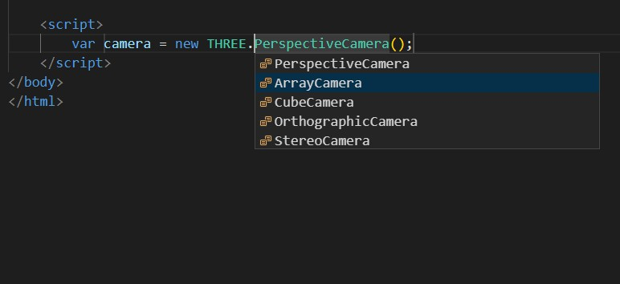

# threejs README

This is a snippets for threeJs.

## Usage
|trigger|contents|
|:--:|:--:|
|tbi|three basic init(including camera & scene & renderer(default is WebGLRenderer))|
|cam|camera constructor|
|geo|geometry constructor|
|hlp|helper constructor|
|mat|material constructor|
|lig|light constructor|
|ls|lights/shadows constructor|
|load|loaders constructor|
|obj|object constructor|
|ren|renderer constructor|
|fog|fog construtor| 
|text|texture constructor|

## Known Issues

althrough I have known and understand snippets syntax. But the result is unsatisfying. For example:
when you type `cam`, below is the result

what I wish the variable name is xxCamera. But in fact I spend much time on it, the result always fails.

So I need help if you do well in snippets syntax, you can issue on [it]().

## Release Notes

### 1.1.0

-----------------------------------------------------------------------------------------------------------

**Enjoy!**
